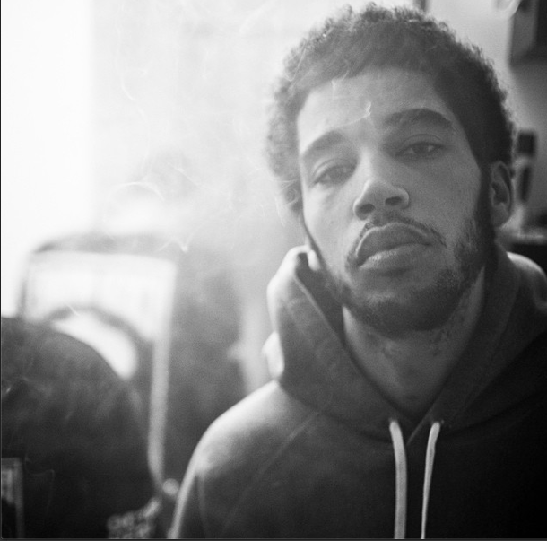

Welcome to the second edition of [Mason Lynaugh's](http://333vinyl.us/authors/mason-lynaugh.html) If We Hung Out. This edition features Travi$ Scott, Andrea, and Jimmy Johnson.

[**Travi$ Scott - "Drugs You Should Try It"**](https://soundcloud.com/travisscott-2/04-drugs-you-should-try-it): Around two weeks ago, Travi$ Scott released a surprise mixtape. Not only was it a surprise in terms of release–he pulled a Beyonce–but it was also surprisingly put together. Travis Scott, an XXL freshman from 2013, has a lot of enemies for good reasons. He first made ripples throughout the blogosphere when he released ["Lights"](https://www.youtube.com/watch?v=Vld3uWewvyI), and, clearly rife with talent, he continued to generate buzz until he signed a 360 deal as a producer for [G.O.O.D. Music](https://www.youtube.com/watch?v=KC-1AaTonTs) and a rapper for [Grand Hustle](https://www.youtube.com/watch?v=2uQfbc3NLz8). However, his entire career has been marred with scandal. He has been attacked for ragging on T.I. and Jay-Z, two of his collaborators, stealing beats, album artwork, and aggravating fans by heedlessly making and subsequently missing release dates. His debut mixtape "Owl Pharaoh", was a testament to his nature. It was messy, uneven, and poorly handled, but it provided the listener with glimpses into his mind and his obvious talent behind the mic and the boards. “Drugs You Should Try It” is haunting and magnificent. The auto-tuned wailing adds a shocking amount of humanity to a poignant sample, and Scott’s rapping has made dramatic improvement. The entire mixtape is worth a listen, especially these  [two](https://www.youtube.com/watch?v=dY5F5EsQwqE) [songs](https://www.youtube.com/watch?v=qFbrRXdruv4). You’ll find an incredible level of depth to the production, especially in the latter.

[**Andrea - "Your Morning"**](https://www.youtube.com/watch?v=4fhwCvafjYA): Anyone who knows me knows that this is one of my all time favorite songs. By a French producer named Andrea (whether that is pronounced anh-drey-ah or ann-dree-ah is beyond me), who is actually not a female, despite the name. To me, it is the perfect morning song (apt title), and the ideal song for a sunny day in a green field. I use it as an alarm on my iPhone because it makes waking up enjoyable, and I have so much nostalgia attached to it that on rough days it can bring up some emotions, ya feel? Sonically, it reminds me of water flowing through a creek. I’m sitting there adjacent two a pair of stones engulfed in moss, and smiling with a childhood friend.

[**Jimmy Johnson - "Northside"**](https://www.youtube.com/watch?v=xPgcSFO6qOg): For almost a year the Toronto-based rapper Jimmy Johnson and Austin, Texas producer Eric Dingus have been making relatively silent moves above the border. Affiliated with the label "Prime", Johnson and Dingus have been inching into the inner circle of Drake’s imprint OVO, and with the title of Drake’s 4th studio effort inspired by Jimmy Johnson, popularizer of the term “The 6”, it seems they have cemented their place. Jimmy Johnson is a fairly middle of the line rapper, but when he combines his vocals with auto-tune and a signature Dingus beat, he does what many auto-tune proficinatos does and becomes more of an instrument than an MC. “Northside” is his best effort yet, with a gritty beat and an infectious chorus, while his debut mixtape some has [gems](https://www.youtube.com/watch?v=j-4uWvz3bJk) as well (the mixtape is fairly good and is definitely worth a few listens). Dingus as well, is someone to watch. I give him until Drake’s next album (which I assume will include his production) to blow up even more than he already has. After [performing](https://soundcloud.com/octobersveryown/octobers-very-own-presents-haw-eric-dingus-mixtape) at OVO’s Houston Appreciation Weekend, and being featured on the OVO blog [multiple times](http://octobersveryown.blogspot.com/2013/11/drake-worst-behavior-eric-dingus-remix.html), his remixes are getting serious traffic. His label, Dream Sequence Records, is working on assembling a roster and already has reached some [talent](https://soundcloud.com/dream-sequence-records/dowrong-shooters-prod-eric). Jimmy Johnson and Eric Dingus should definitely be on your radar.
